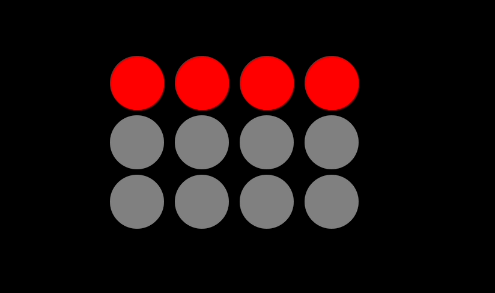

# Traffic Light Challenge

A simple interval simulating traffic lights, with set times for each colour, built in Next.js + TypeScript

## Demo #1

<!--  -->
)

Simulation when no initial state is passed into the component

## Demo #2

Simulation when several initial states are passed into each component